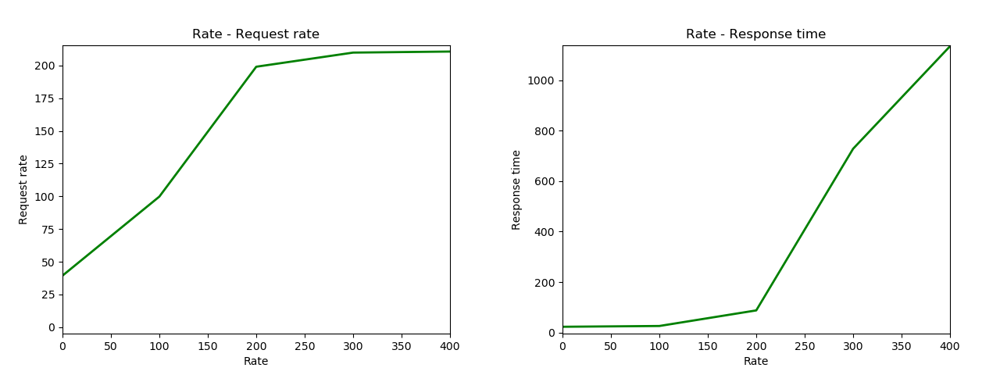

[httperf](https://github.com/httperf/httperf) has is very adjustable and therefore fits our usecase.

## Retrieve the front page
Call:
```
httperf --server ryan.dse.in.tum.de --port 8080 --num-conns 1000 --num-calls=1 --uri / --method GET --server-name ryan.dse.in.tum.de:8080
```
Result:
```
httperf --client=0/1 --server=ryan.dse.in.tum.de --port=8080 --uri=/ --send-buffer=4096 --recv-buffer=16384 --ssl-protocol=auto --method=GET --num-conns=1000 --num-calls=1
Maximum connect burst length: 1

Total: connections 1000 requests 1000 replies 1000 test-duration 3.785 s

Connection rate: 264.2 conn/s (3.8 ms/conn, <=1 concurrent connections)
Connection time [ms]: min 3.3 avg 3.8 max 7.1 median 3.5 stddev 0.4
Connection time [ms]: connect 0.0
Connection length [replies/conn]: 1.000

Request rate: 264.2 req/s (3.8 ms/req)
Request size [B]: 71.0

Reply rate [replies/s]: min 0.0 avg 0.0 max 0.0 stddev 0.0 (0 samples)
Reply time [ms]: response 3.7 transfer 0.1
Reply size [B]: header 1521.0 content 19480.0 footer 2.0 (total 21003.0)
Reply status: 1xx=0 2xx=1000 3xx=0 4xx=0 5xx=0

CPU time [s]: user 0.90 system 2.88 (user 23.8% system 76.2% total 100.0%)
Net I/O: 5437.2 KB/s (44.5*10^6 bps)

Errors: total 0 client-timo 0 socket-timo 0 connrefused 0 connreset 0
Errors: fd-unavail 0 addrunavail 0 ftab-full 0 other 0
```

With the `httperf-plot` script described in [optimization.md](./optimization.md) we can have the following plot. See details in the corresponding section.



## Post a page to the blog
This benchmark uses the data from `bench2_content` file to create a summy page in the blog. It is executed 1000 times and uses Basic auth for authentication.

Please activate the plugin `miniOrange API Authentication plugin` and configure `Basic Auth`. Then you can you the following command to reproduce the test.

Call:
```
httperf --server ryan.dse.in.tum.de --port 8080 --wsesslog=1000,1,bench2_content --add-header="Content-Type: application/json\nAuthorization: Basic YmVuY2g6YmVuY2g\n"
```
Result: 
```
httperf --client=0/1 --server=ryan.dse.in.tum.de --port=8080 --uri=/ --send-buffer=4096 --recv-buffer=16384 --ssl-protocol=auto --add-header='Content-Type: application/json\nAuthorization: Basic YmVuY2g6YmVuY2g\n' --wsesslog=1000,1.000,bench2_content
Maximum connect burst length: 1

Total: connections 1000 requests 1000 replies 1000 test-duration 189.977 s

Connection rate: 5.3 conn/s (190.0 ms/conn, <=2 concurrent connections)
Connection time [ms]: min 13.4 avg 190.0 max 325.1 median 211.5 stddev 82.1
Connection time [ms]: connect 0.0
Connection length [replies/conn]: 1.000

Request rate: 5.3 req/s (190.0 ms/req)
Request size [B]: 6968.0

Reply rate [replies/s]: min 3.6 avg 4.5 max 6.0 stddev 0.7 (37 samples)
Reply time [ms]: response 189.8 transfer 0.1
Reply size [B]: header 655.0 content 12802.0 footer 2.0 (total 13459.0)
Reply status: 1xx=0 2xx=843 3xx=0 4xx=157 5xx=0

CPU time [s]: user 46.19 system 143.78 (user 24.3% system 75.7% total 100.0%)
Net I/O: 105.0 KB/s (0.9*10^6 bps)

Errors: total 0 client-timo 0 socket-timo 0 connrefused 0 connreset 0
Errors: fd-unavail 0 addrunavail 0 ftab-full 0 other 0

Session rate [sess/s]: min 3.60 avg 5.26 max 6.00 stddev 0.70 (1000/1000)
Session: avg 1.00 connections/session
Session lifetime [s]: 0.2
Session failtime [s]: 0.0
Session length histogram: 0 1000
```

## Profiling and Optimization
Please view the document [optimization.md](./optimization.md).
