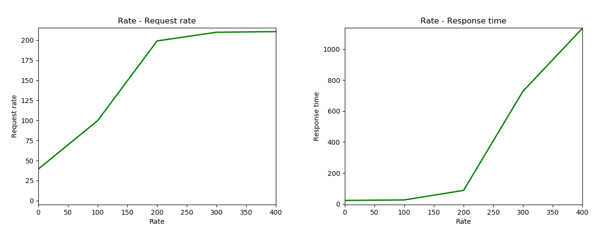

# Profiling and Optimization
## Analyse the bottleneck

We need to investigate the possible system bottlenecks.

First, see how many resources are there
    
    $ lscpu | egrep 'CPU\(s\)'
    CPU(s):                          128
    $ free -mh
                  total        used        free      shared  buff/cache   available
    Mem:          503Gi        43Gi       454Gi       303Mi       4.7Gi       455Gi
    Swap:            0B          0B          0B

Before the benchmark, check the cpu load average(the average number of jobs in the run queue over the last 1, 5 and 15 minutes)

    $ uptime
    14:10:13  up 5 days  5:19,  9 users,  load average: 0.00, 0.08, 0.18

After checking that the cpu is idle currently, we also need to check the sockets situation, use `ss -s`

    ss -s
    Total: 745
    TCP:   112 (estab 20, closed 61, orphaned 0, timewait 0)

    Transport Total     IP        IPv6
    RAW	  2         0         2        
    UDP	  10        7         3        
    TCP	  51        36        15       
    INET	  63        43        20       
    FRAG	  0         0         0 

It is also accecpted, then we can run the load testing command at local or on the server. The following command will try to generate 500 connections per second with total connection numbers 10k:

    $ httperf --server ryan.dse.in.tum.de --port 8080 --num-conns 10000 --uri / --method GET --rate 500

Lets use `top` to see the statics at the same time

    top - 14:12:22 up 5 days,  5:21,  9 users,  load average: 1.31, 0.59, 0.37
    Tasks: 2074 total,   4 running, 2068 sleeping,   2 stopped,   0 zombie
    %Cpu(s):  2.7 us,  0.5 sy,  0.0 ni, 96.6 id,  0.0 wa,  0.0 hi,  0.2 si,  0.0 st
    MiB Mem : 515336.0 total, 465948.3 free,  44601.8 used,   4785.9 buff/cache
    MiB Swap:      0.0 total,      0.0 free,      0.0 used. 466775.4 avail Mem 
    
        PID USER      PR  NI    VIRT    RES    SHR S  %CPU  %MEM     TIME+ COMMAND
     931570 promtail  20   0 1771672 209108  12288 S  90.4   0.0   0:32.76 mysqld 
    1000795 82        20   0  170316  27448  19340 R  64.6   0.0   0:03.84 php-fpm
    1000296 82        20   0  170324  27496  19360 R  64.2   0.0   0:13.94 php-fpm
    1000718 82        20   0  170316  27464  19356 S  64.2   0.0   0:10.93 php-fpm
    1000721 82        20   0  170324  27504  19360 S  64.2   0.0   0:10.13 php-fpm
    1000350 82        20   0  170324  27500  19356 R  63.9   0.0   0:13.11 php-fpm                                                                                     4288 root      20   0   10.3g 102660  34180 S   5.3   0.0  40:40.70 dockerd                                                                                   932127 101       20   0    7112   2744    852 S   4.6   0.0   0:01.71 nginx 

We can see from the third line that the average cpu usage is low (as we have 128 cpus), idle time 96.6%, and the average memory usage is also only about 50%.
We can also find in the following lines that there are only 5 php-fpm processes and mysqld processes running.

Lets see the details of those jobs on cpus to see how can we achieve a better throughput.

Use the following command to activate `sysstat`

    $ nix-shell -p sysstat

Then we can use the command `pidstat -u 5 1` to see the cpu status of each process, and output one group of infomation after 5 seconds

    $ pidstat -u 5 1
    02:32:25 PM   UID       PID    %usr %system  %guest   %wait    %CPU   CPU  Command
    02:32:30 PM   999    918533    0.20    0.20    0.00    0.00    0.40    20  mysqld
    02:32:30 PM   999    931570   81.62   30.83    0.00    0.00  112.45    61  mysqld
    02:32:30 PM     0    931687    0.40    0.79    0.00    0.00    1.19    97  containerd-shim
    02:32:30 PM     0    931716    0.00    0.59    0.00    0.00    0.59    28  php-fpm
    02:32:30 PM   101    932127    0.79    4.15    0.00    0.00    4.94     5  nginx
    02:32:30 PM   101    932129    0.00    0.40    0.00    0.00    0.40     3  nginx
    02:32:30 PM  4000   1001761    0.20    0.79    0.00    0.00    0.99    52  top
    02:32:30 PM    82   1007523   68.77   11.46    0.00    0.00   80.24   127  php-fpm
    02:32:30 PM    82   1007568   68.97   11.26    0.00    0.00   80.24   120  php-fpm
    02:32:30 PM    82   1007616   69.37   10.87    0.00    0.00   80.24    35  php-fpm
    02:32:30 PM    82   1007855   68.58   12.06    0.00    0.00   80.63    60  php-fpm
    02:32:30 PM    82   1007924   68.77   11.66    0.00    0.00   80.43    96  php-fpm

So we can find two problems:

1. the father process of php-fpm does nothing, its five children takes over most of the jobs, and they are on different cpus. The `%wait` is 0 means that they are not waiting IO or cpu schedule too much. So we could increase the system performance simply by add more working subprocess of php-fpm.

2. mysqld is also working relatively heavily even when we are request for the same page.

## Lets do some profiling and benchmark of the system and draw a flamegraph

1. install bcc on the server by nix `nix-env -i bcc`
2. run load testing command `httperf --server ryan.dse.in.tum.de --port 8080 --num-conns 3000 --uri / --method GET --rate 600`
3. do profiling `profile -F 99 -adf 60 > out.profile-folded`
4. copy the file from the server and clone repo FlameGraph `git clone https://github.com/brendangregg/FlameGraph && cd FlameGraph`
5. `./flamegraph.pl --colors=java out.profile-folded > bccprofile.svg`

If have problems,
you can also use `perf` 
```
# perf record -F 99 -a -g -- sleep 30
# perf script | ./stackcollapse-perf.pl > out.perf-folded
# ./flamegraph.pl out.perf-folded > perf.svg
```


Then we have the following graph, and it's obviously that php-fpm and mysqld are heavily cpu-consuming. The original svg file is located [here](./res/bccprofile.svg)


Lets analyse this profile. See the enlarged picture below.The `php-fpm` process takes much more cpu times than `mysqld`. And there are two peaks, and five hot functions of php-fpm, namely `__sys_sendto`, `filename_lookup`, `do_sys_poll`, `__sys_recvfrom` and `vfs_read`. These kernel-space functions undertake the responsibility of communication. And they do not occupy too much time slices. So we have little need to optimise them.Most of the time are consumed by the userspace function, eventhough we can not get their symbols, we should know they are doing tasks like scripts interpretation and process management, which may also not have much room for optimization. So we need to find other ways to extend the system performance instead of trying to change the source code.


We can also do some benchmark to see the performance of the default state.

`httperf` is just what we need. It can generate parallel requests and put momentary pressure on the server. With the wrapper script `httperf-plot.py`, we can run `httperf` multiple times to watch how the server behaves at each test point.

Use the script `httperf-plot.py` to plot the benchmark result (this could be done just on the server for reproducability)

1. change directory `cd benchmark`
2. setup python env with matplotlib `nix-shell -p 'python38.withPackages(ps : with ps; [ matplotlib ])'`
3. run scripts in nix-shell to execute 5 tests consequently with `python3 httperf-plot.py --server ryan.dse.in.tum.de --port 8080 --num-conns 500  --uri / --method GET --rate 0 --ramp-up 100,5`

Then we get the plot as follows, it shows that the maximum throughput of the original version can only reach 210+ req/s.



## Configure php web server

So now, lets try to ajdust the number of php working processes.
Just use `git reset --hard xxxxx` to switch to the commits of the different params.

lets check with 25 static children with mysql and no cache.

1. switch to the target commit `git reset --hard a318d6632c5`
2. setup python env again `nix-shell -p 'python38.withPackages(ps : with ps; [ matplotlib ])'`
3. do benchmark `python3 httperf-plot.py --server ryan.dse.in.tum.de --port 8080 --num-conns 2000  --uri / --method GET --rate 100 --ramp-up 100,15`

the terminal output of the benchmark can also be seen at [here](./res/static_25_mysql_nocache.txt)


The performance saturated and droped `--rate = 1000` first, and increased again at `--rate = 1500`. From the terminal output, we can see that, at `--rate = 1000` all the response is `3xx`, which is right as we use nginx to redirected our front-page. But the most of the response at the test point `--rate = 1500` is `5xx`. The server is overloaded.

So the throughput of this case is about `1000 req/s`, it is already a huge improvement.

## Change our database

Different database engine can also make diffences. Here we test with version with `25 max_children and maradb`

1. switch to the target commit `git reset --hard aa732770995`
2. setup python env again `nix-shell -p 'python38.withPackages(ps : with ps; [ matplotlib ])'`
3. do benchmark `python3 httperf-plot.py --server ryan.dse.in.tum.de --port 8080 --num-conns 2000  --uri / --method GET --rate 100 --ramp-up 100,15`

the terminal output of the benchmark can also be seen at [here](./res/static_25_mariadb_nocache.txt)


It can be seen that the thoughput now can reach 1400+ req/s

## Caching

About how to activate cache:
1. activate the wordpress plugin `WP Super Cache`
2. set and update status to `Caching On (Recommended)`

With the version of mysql, lets run the load testing command again, and see the `pidstat`, now we have:

    Average:      999    931570   23.91   13.24    0.00    0.00   37.15     -  mysqld
    Average:        0    931716    0.20    0.40    0.00    0.00    0.59     -  php-fpm
    Average:      101    932127    0.99    4.55    0.00    0.00    5.53     -  nginx
    Average:      101    932129    0.20    0.20    0.00    0.00    0.40     -  nginx
    Average:       82   1032921   78.66   14.82    0.00    0.00   93.48     -  php-fpm
    Average:      999   1034286    0.00    0.20    0.00    0.00    0.20     -  mysqld
    Average:       82   1035084   77.47   15.81    0.00    0.00   93.28     -  php-fpm
    Average:       82   1035093   76.88   16.40    0.00    0.00   93.28     -  php-fpm
    Average:       82   1035653   78.06   15.02    0.00    0.00   93.08     -  php-fpm
    Average:       82   1035660   71.74   14.43    0.00    0.00   86.17     -  php-fpm

The usage of `mysqld` is heavily dropped    

With the propfiling tool, we can also get this [result](./res/bccprofile.svg)

Now, we will use the version of `70 static children with mariadb` to show the improvements taken by caching.

With `python3 httperf-plot.py --server ryan.dse.in.tum.de --port 8080 --num-conns 5000  --uri / --method GET --rate 0 --ramp-up 1000,6` we can get the following two plots of nocache version and cached version.


At this time, httperf is not a good tool to test, as it will let the server create too many sockets in a short time, and report buffer overflow. 

```
$ ss -s
Total: 621
TCP:   17265 (estab 140, closed 17096, orphaned 1, timewait 16882)
```

so we can benchmark with another multithreaded tools wrk, use `nix-shell -p wrk` to activate it

The result for the nocache version and cached version are as follows:

nocache version:
```
[nix-shell:~]$ wrk --latency -t 15 -c 10000 -d 30  http://ryan.dse.in.tum.de:8080
Running 30s test @ http://ryan.dse.in.tum.de:8080
  15 threads and 10000 connections
  Thread Stats   Avg      Stdev     Max   +/- Stdev
    Latency   110.67ms   89.94ms   1.96s    82.45%
    Req/Sec   364.05    248.97     1.19k    68.31%
  Latency Distribution
     50%   79.49ms
     75%   82.93ms
     90%  222.25ms
     99%  263.43ms
  163092 requests in 30.03s, 677.46MB read
  Socket errors: connect 8984, read 0, write 0, timeout 236
  Non-2xx or 3xx responses: 134832
Requests/sec:   5431.01
Transfer/sec:   22.56MB
```
cached version:
```
[nix-shell:~]$ wrk --latency -t 15 -c 10000 -d 30  http://ryan.dse.in.tum.de:8080
Running 30s test @ http://ryan.dse.in.tum.de:8080
  15 threads and 10000 connections
  Thread Stats   Avg      Stdev     Max   +/- Stdev
    Latency    31.55ms  107.43ms   1.90s    98.09%
    Req/Sec     2.38k   785.32     5.02k    64.51%
  Latency Distribution
     50%   15.48ms
     75%   17.57ms
     90%   29.74ms
     99%  753.09ms
  1066975 requests in 30.02s, 11.65GB read
  Socket errors: connect 8984, read 0, write 0, timeout 676
Requests/sec:  35543.57
Transfer/sec:  397.57MB
```

## Conclude

To conclude, with adjusting websever parameters, database and cache, we can achive a hugh improvement on performance. 

The system is still limited by the maximum number of of open files and the port range. As `ulimit -n` only shows `1024`, so each process can only open 1024 files. With `sysctl net.ipv4.ip_local_port_range` we can know the original port range is `32768 60999`, so we have changed it to the `1024 65535` to maximize port utilization. 
