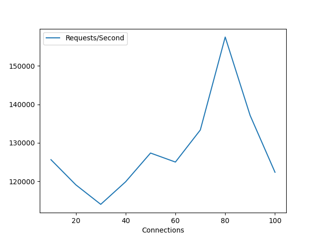

# Setup #

Use the following command to reproduce the results. First, use `nix-shell` to setup environment and compile sources. Then, type `python reproduce.py` mannually to run benchmark. The throughput results will be printed out in the console, the plots could be found in the subfolder `plots`.

```console
[teamx@ryan:~]$ nix-shell
[nix-shell:~]$ python reproduce.py
```


# Brief Intro

In this task, we implement webservers with different I/O methods and benchmark the system performance.
The throughputs are plotted according to different connections. The flamegraph of the cpu profiling is also generated.

But what has to be mentioned is that the benchmark tool `wrk` uses reactor pattern with epoll multiplexing. By default, it uses `HTTP/1.1` and creates keep-alive connections. This will result in that it will not try to close the sockets. So even with few connections we can also achieve high throughput.

During the benchmark, there will be some messages like `recv() failed: Connection reset by peer` or `Empyt request`, it's the perror messages of the server, which is just a log of the events happening. The other messages are not printed out, because non-asynchronous logging will block the system.

The servers use IPv6 protocol and bind to the interface `swissknife0` as its local-link address.

### result

The final result is as follows(Note: These values may change due to server conditions):

server_epoll_multitask(`1135671.21req/s`) > server_thread(`970999.68req/s`) > server_epoll(`124957.35req/s`) > server_select(`88595.91req/s`) ≈ server(`88389.19req/s`) > server_uring(`44156.76req/s`)

Please refer to the report for detailed analysis of the results.

Here are the demo plots generated. (It is fluctuating as expexted, but overall it is stable in a certain range.)

- basic_server:
 
  

- server_select:

  

- server_epoll.png:
 
  

- server_epoll_multitask:
 
  

- server_thread: 

  

- server_uring:
  
  

- Flamegraph of `server_epoll`

  
