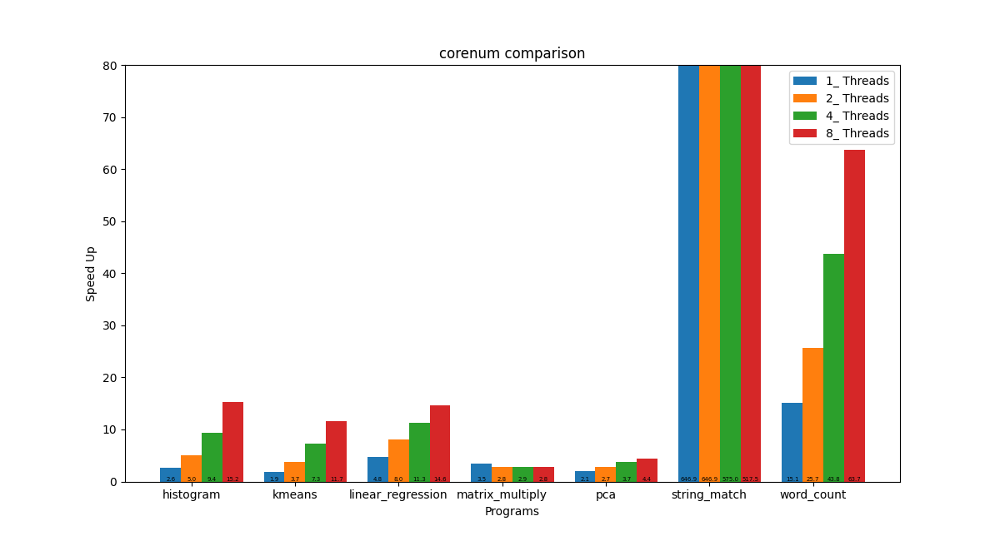

# Multicore Benchmark

Here we do multicore benchmark with project [phoenix++](https://github.com/kozyraki/phoenix) and [parsec-3.0](https://parsec.cs.princeton.edu/)

Please run them individually with the following instructions. The image will be built and the benchmark will be automatically running. And please also note that the compilation of the parsec project is time-consuming. The final results and plots will be saved in the `./result` directory which will be mounted to the host computer.

```shell
cd parsec-3.0            # or cd phoenix
docker-compose up --build
```


### Demo Result
parsec-3.0:


phoenix++:

